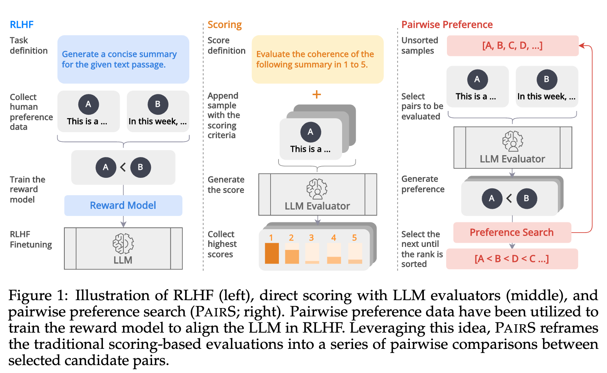

# Code for Aligning with Human Judgement: The Role of Pairwise Preference in Large Language Model Evaluators


**Link to paper**:
[Aligning with Human Judgement: The Role of Pairwise Preference in Large Language Model Evaluators](https://arxiv.org/abs/2403.16950) (arXiv preprint arXiv:2403.16950)

If you find our work helpful, please consider citing our paper:

```
@article{liu2024aligning,
  title={Aligning with Human Judgement: The Role of Pairwise Preference in Large Language Model Evaluators},
  author={Liu, Yinhong and Zhou, Han and Guo, Zhijiang and Shareghi, Ehsan and Vulic, Ivan and Korhonen, Anna and Collier, Nigel},
  journal={arXiv preprint arXiv:2403.16950},
  year={2024}
}
```

## Code

We will release our scripts very soon.

