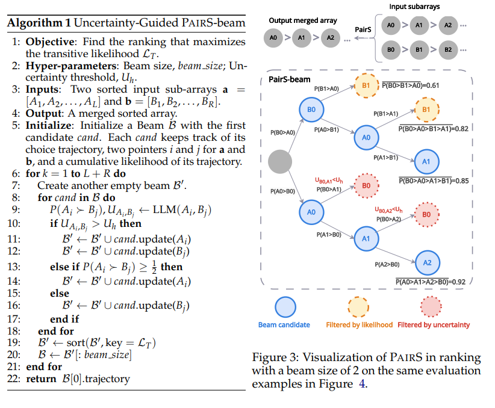
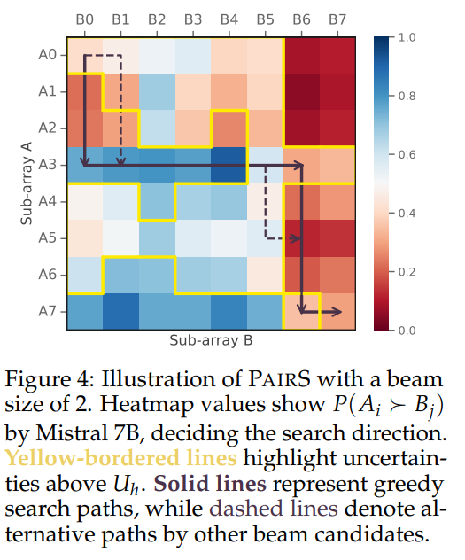

# Code for Aligning with Human Judgement: The Role of Pairwise Preference in Large Language Model Evaluators


**Link to paper**:
[Aligning with Human Judgement: The Role of Pairwise Preference in Large Language Model Evaluators](https://arxiv.org/abs/2403.16950) (arXiv preprint arXiv:2403.16950)  
This paper has been accepted by **COLM 2024**.

If you are interested in pairwise evaluator, please also checkout our latest work on [zero-shot automatic prompt optimization for pairwise evaluators](https://arxiv.org/abs/2406.11370). 

## Code

### Ready-to-use Package
We provide a ready-to-use Python library for Pairwise preference ranking (PairS). We show a ranking demonstration below.
For an input source text and a sequence of output candidates, ```PairsGreedy``` and ```PairsBeam``` can be used to rank the output candidates in **ascending** order.
We currently support the following base models: ```google/gemma-2-9b-it, google/gemma-2-27b-it, meta-llama/Meta-Llama-3-8B-Instruct, microsoft/Phi-3-medium-4k-instruct, microsoft/Phi-3-mini-4k-instruct, mistralai/Mistral-7B-Instruct-v0.1, meta-llama/Llama-2-7b-chat-hf, meta-llama/Llama-2-13b-chat-hf, HuggingFaceH4/zephyr-7b-beta, gpt-3.5-turbo, gpt-4-turbo```. 


```python
from pairs import PairsGreedy, PairsBeam
from scripts.utils import shuffle_lists, load_summEval


# Load example data
summ_eval_path = 'data/SummEval/model_annotations.aligned.paired.jsonl'
input_doc, output_doc, _ = load_summEval(summ_eval_path, flat_output=False)

doc_id = 42
input, output = input_doc[doc_id], output_doc[doc_id]
input, output = shuffle_lists(input, output)

# The same input source text corresponds to multiple output summaries
print('Number of summary candidates:', len(output))

method = 'PairsGreedy'
if method == 'PairsGreedy':
    # Set hyperparameters
    params = {
        # 'engine': "mistralai/Mistral-7B-Instruct-v0.1",
        'engine': "meta-llama/Llama-2-7b-chat-hf",
        'api_call': 0,
        'with_input': True,
        'calibrate': False,
    }
    # Rank the output summaries from low to high quality
    indices = PairsGreedy(input[0], output, params)
    print(indices)

elif method == 'PairsBeam':
    # Set hyperparameters
    params = {
        'engine': "mistralai/Mistral-7B-Instruct-v0.1",
        'beam_size': 2000,
        'api_call': 0,
        'prob_gap': 0.1,
        'with_input': True,
        'calibrate': False,
    }
    # Rank the output summaries from low to high quality
    indices = PairsBeam(input[0], output, params)
    print(indices)
```


### Evaluate on Datasets
We also present the original code (in the folder ```scripts/```) to evalute on the datasets reported in the paper.

For NewsRoom and SummEval
```python
bash pairs_run.sh
```

<!-- For Hanna
```python
bash pairs_flat_run
``` -->

### Notebook Demo
We provide a Notebook demonstrations in ```notebooks/```.

### Break downs
**Load dataset**: We put all datasets loading in ```scripts/utils.py```.  

**Prompts**: We put all prompts and instructions in ```scripts/prompts.py```.  

**Base models**: We supports the following base models, ```mistralai/Mistral-7B-Instruct-v0.1```, ```meta-llama/Llama-2-7b-chat-hf```, all versions of ```GPT-3.5-turbo``` and ```GPT-4-turbo```.  

**Hyper-parameters**:
  - ```dataset```: We support 3 datasets, 'newsroom', 'SummEval' and 'hanna'.
  - ```eval_method```: For all PairS method, we use 'pairwise comparison'.
  - ```engine```: The base models.
  - ```with_input```: If the data format has input text. For example, the summarization task has source text as input, but story writing task has no input text.
  - ```confidence_beam```: ```True``` for PairS-beam and ```False``` for PairS-greedy.
  - ```prob_gap```: The uncertainty tolerance. $0.1$ represents we will create beam candidates for both A and B if $0.5-0.1 < P(A\succ B) < 0.5+0.1$.

More details and comments will be added soon.

## Algorithm of PairS-Beam
The PairS-Greedy can be understood as a merge sort with pairwise comparison by LLMs, while the PairS-Beam is to do a beam-search for each merge operation. In order to improve the beam search efficiency and limit the search space, we also apply a local uncertainty-based prunning mechanism.

We show the algorithm of the modified merge operation for PairS-Beam below. 




### A Beam-search Merge Operation Demonstration

For more details please check out our paper.

## Citation
If you find our work helpful, please consider citing our paper:

```
@article{liu2024aligning,
  title={Aligning with Human Judgement: The Role of Pairwise Preference in Large Language Model Evaluators},
  author={Liu, Yinhong and Zhou, Han and Guo, Zhijiang and Shareghi, Ehsan and Vulic, Ivan and Korhonen, Anna and Collier, Nigel},
  journal={arXiv preprint arXiv:2403.16950},
  year={2024}
}
```
